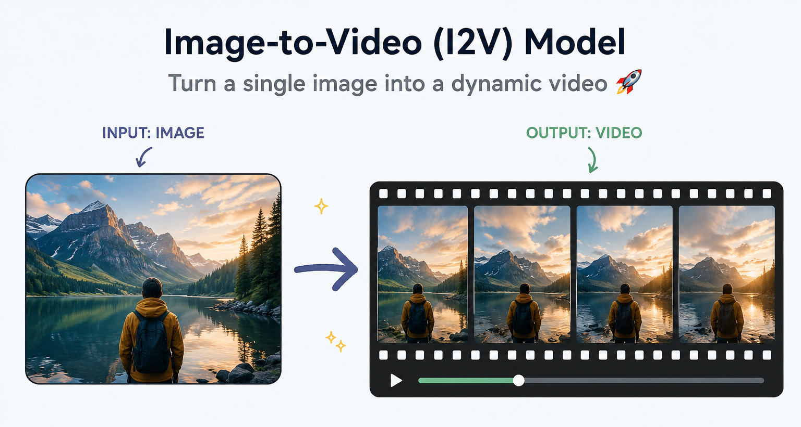
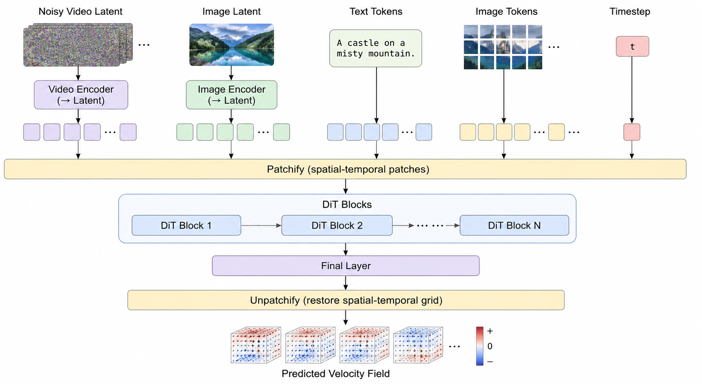
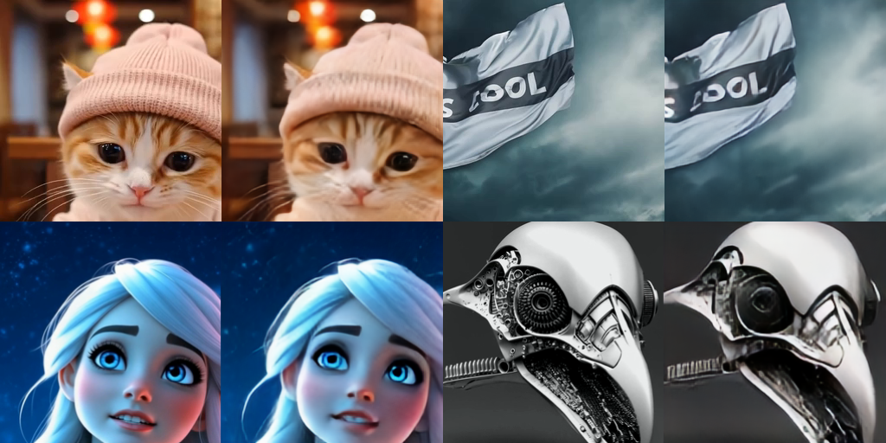
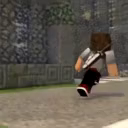
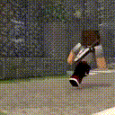
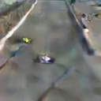
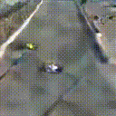

# NanoI2V: Building an Image-to-Video Model from Scratch

<p align="center">
  
</p>

<p align="center">
  
  
  
  
  
</p>

# Overview

NanoI2V is a **from-scratch implementation** of an **Image-to-Video (I2V)** generation pipeline.

The project focuses on understanding and implementing the core concepts and building blocks behind modern video generation systems such as:

- Variational Autoencoders (VAE)
- Latent Video Modeling
- Diffusion / Flow Matching
- DiT Transformers
- Cross-Attention Conditioning
- Classifier-Free-Guidance


---

> The series is published as a dedicated website with structured lessons, explanations, and code walkthroughs:
> **[shubham2376g.github.io/NanoI2V](https://shubham2376g.github.io/NanoI2V)**
>
> Each topic is a self-contained lesson - read in order or jump to what you need.

---

## What This Series Covers

This series explores the core building blocks behind modern image-to-video (I2V) models, including topics such as:

| Area | Topics |
|---|---|
| VAE | Causal 3D convolutions, residual blocks, video encoders & decoders |
| DiT | Rotary positional embeddings (RoPE), attention mechanisms, adaptive LayerNorm |
| Flow & Diffusion | Flow matching, schedulers, denoising concepts |
| Conditioning | Text conditioning, image conditioning, multimodal embeddings |
| Training | End-to-end training pipeline, optimization, inference |

Additional topics and modules will be added as the series evolves.

---

## Repository Structure

```text
NanoI2V/
├── vae/
│   ├── conv.py                 # CausalConv3D implementation
│   ├── blocks.py               # 3D ResBlocks and Spatial Attention modules
│   ├── encoder.py              # VAE encoder
│   ├── decoder.py              # VAE decoder
│   └── vae.py                  # VAE model definition
│
├── dit/
│   ├── rope.py                 # 3D Rotary Positional Embeddings (RoPE)
│   ├── attention.py            # Self-Attention and Cross-Attention layers
│   ├── blocks.py               # DiT blocks with Adaptive LayerNorm (adaLN)
│   └── dit.py                  # Diffusion Transformer (DiT) architecture
│
├── flow/
│   └── scheduler.py            # Flow Matching scheduler
│
├── conditioning/
│   └── encoders.py             # Text and image conditioning encoders
│
├── data/
│   ├── download_vidgen.py      # Dataset download utilities
│   ├── prepare_vidgen.py       # Dataset preparation pipeline
│   └── preprocess_vae.py       # VAE preprocessing scripts
│
├── docs/
│   └── index.html              # Project website (GitHub Pages)
│
├── train_vae.py                # VAE training script
├── train_dit.py                # DiT training script
├── inference_dit.py            # Inference and video generation
│
└── README.md                   # Project documentation
```

---


## High-Level DiT Pipeline

NanoI2V follows the latent diffusion paradigm, where the Diffusion Transformer (DiT) operates entirely in the **latent space** produced by the VAE instead of directly on pixels.

During each denoising step, the model takes:

- **Noisy video latents** to be denoised
- **Image latents** extracted from the conditioning image
- **Text tokens** from the prompt encoder
- **Image tokens** from the image encoder
- **Timestep embeddings** indicating the current diffusion step

These inputs are converted into spatial-temporal patches and processed by a stack of **DiT blocks** consisting of self-attention, cross-attention, MLP layers, and Adaptive LayerNorm (adaLN). The final layer predicts the **velocity field**, which is used by the flow-matching scheduler to iteratively transform noise into the target video latent.

<p align="center">
  
</p>

<p align="center">
<i>Simplified overview of the NanoI2V generation pipeline. The figure emphasizes the flow of information between components rather than the exact implementation. Detailed architectural components are introduced in later chapters.</i>
</p>

---


## Results

The following results were generated using the models implemented in this repository.

### VAE Reconstruction Results

The VAE is trained to compress video clips into a latent representation and reconstruct them with minimal quality loss.





---

### DiT Video Generation Results

The Diffusion Transformer (DiT) is trained in latent space and generates video sequences conditioned on an input image.

#### Example 1

<table>
  <tr>
    <td align="center"><b>Input Image</b></td>
    <td align="center"><b>Generated Video</b></td>
  </tr>
  <tr>
    <td align="center">
      
    </td>
    <td align="center">
      
    </td>
  </tr>
  <tr>
    <td colspan="2" align="center">

**Text Prompt**

*Third-person follow shot of a Minecraft-style character running down a stone pathway. The character has brown hair, a grey shirt, and a sword strapped to their back, captured mid-stride from behind. The surrounding environment features textured cobblestone walls and building facades under natural daylight. Smooth animation, blocky voxel aesthetic.*

</td>
  </tr>
</table>

---

#### Example 2

<table>
  <tr>
    <td align="center"><b>Input Image</b></td>
    <td align="center"><b>Generated Video</b></td>
  </tr>
  <tr>
    <td align="center">
      
    </td>
    <td align="center">
      
    </td>
  </tr>
  <tr>
    <td colspan="2" align="center">

**Text Prompt**

*High-angle overhead shot of Formula 1 race cars navigating a sharp, wide turn on a grey asphalt track. The camera smoothly zooming and closing in on the bright green and yellow F1 car as it accelerates. The background shows a blurry race barrier and spectator area. Realistic lighting, high speed motion blur.*

</td>
  </tr>
</table>


---
## Prerequisites

A basic understanding of the following will help:

- PyTorch basics
- Transformer architecture and attention mechanisms
- LLM fundamentals
- Diffusion model intuition (helpful but not required)

If you've worked with LLMs before, many concepts here will feel familiar.

---

## ⭐ Support the Project

If you find this useful:
- Star the repository ⭐
- Share it with others interested in diffusion or video models

<p>
  <a href="https://www.linkedin.com/in/shubham-aggarwal-a63b40276">
    
  </a>
</p>
